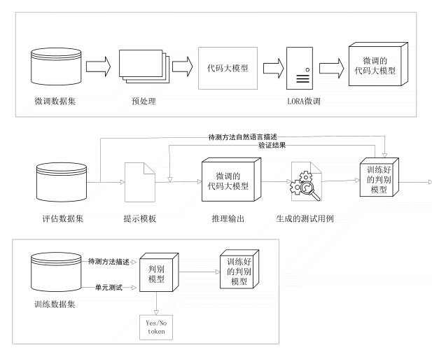

>图 1 基于重排序算法的代码单元测试用例生成框架

> 图 2 基于提示工程和判别模型的单元测试生成框架

**基于重排序算法的代码单元测试用例生成框架概述**

*成果论文：CodeCov: A Coverage-Driven Reranking Framework for Unit Test Generation*

本课题的研究目标是文本到测试的单元测试生成。重排序框架的目的是通过温度采样得到大量多样性的模型生成结果，通过重排序找到可能最优的结果。使用温度采样而不使用束搜索是因为最近的研究表明对于代码生成，束搜索通常 利用大模型在大规模采样后会有更大概率产生正确结果的特性进一步释放大模型能力。本课题设计的重排序框架首先通过提示词在用文本生成测试用例的同时生成待测函数，然后通过对待测函数执行生成的测试用例得到执行结果。通过执行结果对采样的大量待测函数和测试用例进行归类得到共识集。再通过进一步的排序算法设计对共识集排序，在共识集内部则用代码覆盖率减少冗余测试最后得到测试用例集的排序结果，初步实验结果证明有效提高了测试用例集的通过率并且减少了冗余。

**基于提示工程和判别模型的单元测试生成框架概述**

单元测试生成框架分为三个部分：
* 第一部分微调代码大模型，大模型的训练成本太高，本课题采用微调技术在特定任务上提高大模型的输出表现。采用LORA微调（低阶自适应微调）的方式，基本原理是冻结预训练好的模型权重参数，在冻结原模型参数的情况下，通过往模型中加入额外的网络层，并只训练这些新增的网络层参数。由于这些新增参数数量较少，这样不仅微调的成本显著下降，还能获得和全模型参数参与微调类似的效果。研究表明LORA微调使得硬件参数的门槛降低到三分之一，且效果很好。与完全微调的方法相比，没有引入推理延迟，且与其他如prefix-turning等微调方法不冲突可以结合微调。在对代码预训练大模型通过自己构建的单元测试数据集微调之后得到微调好的代码大模型。
* 第二部分训练判别模型，对于序列生成任务，生成式大模型是当前性能最好的选择，在整个单元测试生成框架中，本课题使用了一个判别式模型来对大模型的生成结果进行判断，判断是否正确，通过如BERT，T5的基础模型这类参数量较小的模型尝试捕捉自然语言描述和生成的单元测试例如数据类型和值范围这类语义特征得到结果，可以过滤代码大模型的输出结果或者返回结果给大模型输入模板中进行二轮推理，进一步提高结果的准确度。判别模型的训练同样先构造训练集数据集，之后对判别模型进行训练，判别模型可以选择codeT5这类已经有对代码语言和自然语言有过预训练的模型。之后得到训练好的判别模型。
* 第三部分是总流程，用评估数据集作为输入，使用提示工程的方法设计提示模板，然后将改造后的提示输入给微调后的代码大模型生成测试用例，然后将生成的测试用例和之前的自然语言描述结合输入给训练好的判别式模型，得到结果移除错误的用例，或者返回验证结果进行二轮推理。